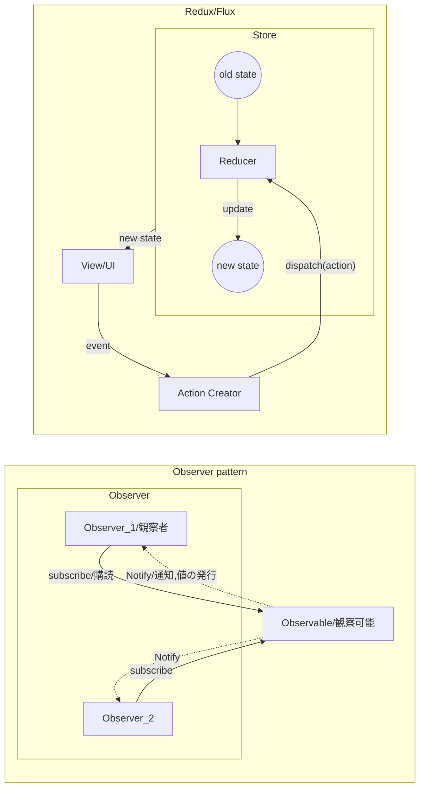
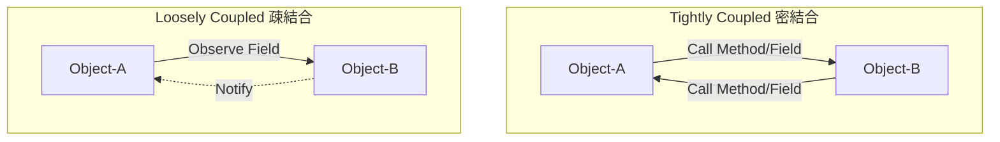

# Note

## 1. GUI Framework

GUIの開発において、portability(可搬性)を上げるにはどうするか

- 下地(Logic)は低レイヤー
- 上地(GUI)だけ使いまわしたい
- 上地(GUI)は都度(User, Developer毎)に差し替えたい

**各レイヤでの使用言語の使い分け傾向**

- web technology (front-end)
  - HTML/CSS, Javascript, Node.js, React, wasm
  - browser, Chromium
  - 『プラットフォームを選ばない』
- web technology (back-end)
  - Java, Ruby, JavaScript, SQL
  - Server, API
- native application (managed code)
  - C#(.Net), Swift, Kotlin, Java
  - garbage collection(ARC), Common Intermediate Language(JIT compiler)
- native application (unmanaged/native code)
  - C++, Rust

**native applicationでのGUIライブラリ**

native applicationに対し、web資産の活用・流用としてElectron/WebViewのような技術がある

- Windows GUI 
  - GTK, Qt, WinForms, WPF, UWP, MAUI
  - Qt:M-VC, WPF:MVVM
- Electron
  - since 2013
  - native app向けGUI Framework, cross-platform
  - GUIにChromium+Node.js = web技術の転用
  - Slack, Discord, GitHub Desktop, Atom, VScode
- WebView
  - Android/iOSのcomponent(OSの機能)
  - スマートフォンapp, Social-network gameなど
  - browser in app
- Tauri
  - rust製, Electronの代替を目指す
  - ChromiumではなくWebViewを使用

**JavaScript Framework**

WebViewを使用するとして、JavaScript側でどのFrameworkを使用するか

- React
  - CDN動く
  - デカい
  - Component-Based/Virtual DOM/JSX
- Angular
  - No CDN
  - RxJS採用
- Vue.js
  - CDN動く
  - MVVM
  - SPAに向いてる
  - template tag = HTML5ベース
- Riot
  - CDN動く
  - 軽量
  - 双方向データバインディングはX
  - 人気がない

c#(wpf)やrust(wry)上に乗せることを考慮し以下の理由からVue.jsを選択

- CDN
  - native code側で実行をコントロールしやすい
  - html/javascriptの外部からの差し替え容易性
- MVVM
- HTML5ベース

## 2. GUI Architecture / Design Pattern

### GUI Architecture

```
 MVC (Original)

 ┌────┐          Update             ┌─────┐
 │View│◄────────────────────────────┤     │
 └────┘                             │Model│
   Event   ┌──────────┐ Manipulates │     │
  ────────►│Controller├────────────►│     │
           └──────────┘             └─────┘
                                    pt. logic
                                    biz logic
   ViewとModelが密結合
   presentation logicはV or M, Viewが肥大化

 MVP (PassiveView + Observer)

 ┌────┐ Event    ┌─────────┐ Update ┌─────┐
 │    ├─────────►│         ├───────►│     │
 │View│ Update   │Presenter│ Notify │Model│
 │    │◄─────────┤         │◄─ - - -│     │
 └────┘          └─────────┘        └─────┘
                  pt. logic          biz logic

    Presenter -> View の参照がある

 MVVM

 ┌────┐ DataBind ┌─────────┐ Update ┌─────┐
 │    │◄────────►│         ├───────►│     │
 │View│ (Notify) │ViewModel│ Notify │     │
 │    │◄─ - - - -│         │◄─ - - -│     │
 └────┘          └─────────┘        │     │
                                    │Model│
 ┌────┐ DataBind ┌─────────┐ Update │     │
 │    │◄────────►│         ├───────►│     │
 │View│ (Notify) │ViewModel│ Notify │     │
 │    │◄─ - - - -│         │◄─ - - -│     │
 └────┘          └─────────┘        └─────┘
                  pt. logic          biz logic
                                     Data
　  依存の方向 V -> VM, VM -> M
    DataBinding前提
    揮発性
```



- Redux/Flux
  - 関数型で冪等(べきとう)性の確保 (何回実行しても実行結果が同じ状態)
  - stateはReadOnlyなimmutable
  - viewはReactなどvirtual DOM。イメージ的には「まるまるviewの差し替え」

### Loosely Coupled



Object-AとObject-Bが互いに知っている（参照を持っている）  
↓
Object-AはObject-Bを知っているが、Object-BはObject-Aを知らない  

というように分離しやすい構造

-> Dependency Injection (依存性の注入)  
Class-Bをmockなどに差し替えする = 開発の分離/テストの実現容易性

#### Dependency Injection container

- ServiceLocatorパターンの代用
- Singletonパターンの代用
- Propertiesクラスの代用
- Service Locator Patternはアンチパターン
  - GetServiceメソッドを使用, DIはコンストラクタ注入、プロパティ注入、メソッド注入

- C# : Microsoft.Extensions.DependencyInjection
  - scope
    - Singleton ```AddSingleton<T,U>()```
    - Scoped ```AddScoped<T,U>()``` : 特定のスコープ毎に新しいインスタンスを生成
    - Transient ```AddTransient<T,U>()``` : 依存の解決を要求するたびに新しいインスタンスを生成
  - Injection
    - constructor injection 
    - method injection : 非対応
    - properties/fields injection : 非対応
- Rust
  - Cake Pattern
  - struct ベースかtrait ベースか
- Javascript
  - 動的型付き言語ではそもそも必要がない


## 3. GUI

### WVVM

Helper Class for wpf/C#

```
  ┌─────────────────────────┐           ┌─────────┐        ┌─────┐
  │ View                    │ DataBind  │         │ Update │     │
  │ Wpf                     │◄─────────►│         ├───────►│     │
  │             ┌─────────┐ │ (Notify)  │ViewModel│ Notify │     │
  │             │         │ │◄─ - - - - │         │◄─ - - -│     │
  │             │behavior │ │           │         │        │     │
  │             │         │ │           │         │        │     │
  │             └────┬────┘ │           └─────────┘        │Model│
  │                  │      │                              │     │
  └───────────────── │ ─────┘                              │     │
                     ▼ Notify(post or ExecuteScriptAsync)  │     │
  ┌────┐ Event  ┌─────────────────────────────────┐        │     │
  │View├───────►│                                 │ Update │     │
  │Html│ Update │           Presenter             ├───────►│     │
  │    │◄───────┤                                 │        │     │
  └────┘        └─────────────────────────────────┘        └─────┘
                                      biz/pt. logic         biz logic
                                      data                  data
```

- PがModelを間接的に監視してる
- javascript側のLogicをviewを通さないとアクセスできない = viewがmodelを参照してる

### wry

Cross-platform WebView rendering library in rust

```
 ┌───────────────┐                 ┌─────────────────┐   
 │ JavaScript    │                 │ Wry             │   
 │ /Html         │                 │                 │   
 │ ┌───────────┐ │ ipc.postMessage │ ┌─────────────┐ │   
 │ │ View      ├────────────────────►│ ipc handler │ │   
 │ │           │ │                 │ │             │ │   
 │ └───────────┘ │                 │ └──────┬──────┘ │   
 │        ▲      │                 │        │        │   
 │        │      │                 │        ▼        │   
 │ ┌──────┴────┐ │ evaluate_script │ ┌─────────────┐ │   
 │ │ Presenter │◄────────────────────┤ event loop  │ │   
 │ │           │ │                 │ │             │ │   
 │ └───────────┘ │                 │ └─────────────┘ │   
 │               │                 │                 │   
 └───────────────┘                 └─────────────────┘   
```

- webview2の一部の機能しか現状は使用できない。
- postMessageでstringが流れるのが前提なので、Redux/Fluxっぽく動かす
- Tauri/Wryは開発途中なので変更多し

### 各比較

#### PrismでのRegion

```xml
<grid>
  <Label/>
  <ContentControl prism:RegionManager.RegionName="ContentRegion"/>
</grid>
```

```cs
public partial class App {
  protected override Window CreateShell() {
    return Container.Resolve<MainWindow>();
  }
  protected override void RegisterTypes(IContainerRegistry containerRegistry) {
    containerRegistry.RegisterForNavigation<Views.ViewA>();
  }
}
public class MainWindowViewModel : BindableBase {
  public MainWindowViewModel(IRegionManager regionManager) {
    _regionManager = regionManager;
    _regionManager.RegisterViewWithRegion("ContentRegion", typeof(Views.ViewA));
  }
}
```
MainWindow.xaml -> MainViewModel.cs -> Model.cs  
ViewAWindow.xaml -> ViewAViewModel.cs -> Model.cs  


## 4. Other

### 文字列補間生文字リテラル比較

c#とrustの{}の扱いが逆でハマる

```rust
// rust
let arg = 1;
let hoge = format!(r##" {{ "hoge" : {n} }}  "##);
```

```cs
// c#
var arg = 1;
var hoge = $$""" { "hoge" : "{{arg}}" } """;
```

```javascript
// javascript
let arg = 1;
let hoge = `{ "hoge" : ${arg}  }`;
```

```python
# python3.6
arg = 1
hoge = f'{{ "hoge" : {arg} }}'
```

```R
# R
arg <- 1
hoge <- stringr::str_glue('{{ "hoge" : {arg} }}')
```
