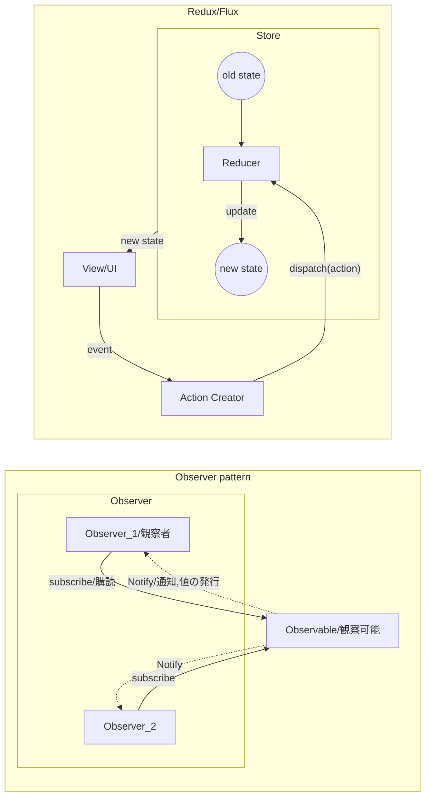
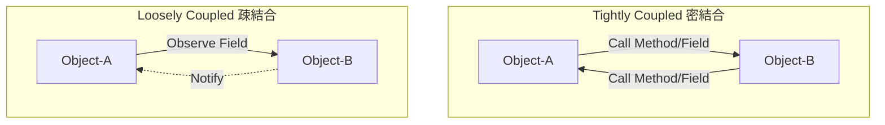

# Note

## 1. GUI Framework

GUIの開発において、portability(可搬性)を上げるにはどうするか

- 下地(Logic)は低レイヤー
- 上地(GUI)だけ使いまわしたい
- 上地(GUI)は都度(User, Developer毎)に差し替えたい

**各レイヤでの使用言語の使い分け傾向**

- web technology (front-end)
  - HTML/CSS, Javascript, Node.js, React, wasm
  - browser, Chromium
  - 『プラットフォームを選ばない』
- web technology (back-end)
  - Java, Ruby, JavaScript, SQL
  - Server, API
- native application (managed code)
  - C#(.Net), Swift, Kotlin, Java
  - garbage collection(ARC), Common Intermediate Language(JIT compiler)
- native application (unmanaged/native code)
  - C++, Rust

**native applicationでのGUIライブラリ**

native applicationに対し、web資産の活用・流用/cross-platformとしてElectron/WebViewのような技術がある

- Windows GUI 
  - GTK, Qt, WinForms, WPF, UWP, MAUI
  - Qt:M-VC, WPF:MVVM
- Electron
  - since 2013
  - native app向けGUI Framework, cross-platform
  - GUIにChromium+Node.js = web技術の転用
  - Slack, Discord, GitHub Desktop, Atom, VScode
- Tauri
  - rust製, Electronの代替を目指す
  - ChromiumではなくWebViewを使用
- WebView
  - Android/iOSのcomponent(OSの機能)
  - スマートフォンapp, Social-network gameなど
  - browser in app

**JavaScript Framework**

WebViewを使用するとして、JavaScript側でどのFrameworkを使用するか

- CDN
  - native code側で実行をコントロールしやすい
  - html/javascriptの外部からの差し替え容易性
- MVVM
- HTML5ベース

- React (nmp trend Jan 2024, 23,000k)
  - CDN動く
  - デカい
  - Component-Based/Virtual DOM/JSX
- Angular (447k)
  - No CDN
  - RxJS採用
- Vue.js (4,440k)
  - CDN動く
  - MVVM
  - SPAに向いてる
  - template tag = HTML5ベース
- Riot (4k)
  - CDN動く
  - 軽量
  - 双方向データバインディングはX
  - 人気がない

c#(wpf)やrust(wry)上に乗せることを考慮しVue.jsを選択

## 2. GUI Architecture / Design Pattern

### 2.1. GUI Architecture

```
MVC (Original)

┌────┐          Update             ┌─────┐
│View│◄────────────────────────────┤     │
└────┘                             │Model│
  Event   ┌──────────┐ Manipulates │     │
 ────────►│Controller├────────────►│     │
          └──────────┘             └─────┘
                                   pt. logic
                                   biz logic
  ViewとModelが密結合
  presentation logicはV or M, Viewが肥大化

MVP (PassiveView + Observer)

┌────┐ Event    ┌─────────┐ Update ┌─────┐
│    ├─────────►│         ├───────►│     │
│View│ Update   │Presenter│ Notify │Model│
│    │◄─────────┤         │◄─ - - -│     │
└────┘          └─────────┘        └─────┘
                 pt. logic          biz logic

  Presenter -> View の参照がある

MVVM

┌────┐ DataBind ┌─────────┐ Update ┌─────┐
│    │◄────────►│         ├───────►│     │
│View│ (Notify) │ViewModel│ Notify │     │
│    │◄─ - - - -│         │◄─ - - -│     │
└────┘          └─────────┘        │     │
                                   │Model│
┌────┐ DataBind ┌─────────┐ Update │     │
│    │◄────────►│         ├───────►│     │
│View│ (Notify) │ViewModel│ Notify │     │
│    │◄─ - - - -│         │◄─ - - -│     │
└────┘          └─────────┘        └─────┘
                 pt. logic          biz logic
                                    Data
  依存の方向 V -> VM, VM -> M
  DataBinding前提
  揮発性
```



- Redux/Flux
  - 関数型で冪等(べきとう)性の確保 (何回実行しても実行結果が同じ状態)
  - stateはReadOnlyなimmutable
  - viewはReactなどvirtual DOM。イメージ的には「まるまるviewの差し替え」

### 2.2. Loosely Coupled



Object-AとObject-Bが互いに知っている（参照を持っている）  
↓
Object-AはObject-Bを知っているが、Object-BはObject-Aを知らない  

というように分離しやすい構造

-> Dependency Injection (依存性の注入)  
Class-Bをmockなどに差し替えする = 開発の分離/テストの実現容易性

#### Dependency Injection container

- ServiceLocatorパターンの代用
- Singletonパターンの代用
- Propertiesクラスの代用
- Service Locator Patternはアンチパターン
  - GetServiceメソッドを使用, DIはコンストラクタ注入、プロパティ注入、メソッド注入

- C# : Microsoft.Extensions.DependencyInjection
  - scope
    - Singleton ```AddSingleton<T,U>()```
    - Scoped ```AddScoped<T,U>()``` : 特定のスコープ毎に新しいインスタンスを生成
    - Transient ```AddTransient<T,U>()``` : 依存の解決を要求するたびに新しいインスタンスを生成
  - Injection
    - constructor injection 
    - method injection : 非対応
    - properties/fields injection : 非対応
- Rust
  - Cake Pattern
  - struct ベースかtrait ベースか
- Javascript
  - 動的型付き言語ではそもそも必要がない


## 3. GUI

### WVVM

Helper Class for wpf/C#

```
  ┌─────────────────────────┐           ┌─────────┐        ┌─────┐
  │ View                    │ DataBind  │         │ Update │     │
  │ Wpf                     │◄─────────►│         ├───────►│     │
  │             ┌─────────┐ │ (Notify)  │ViewModel│ Notify │     │
  │             │         │ │◄─ - - - - │         │◄─ - - -│     │
  │             │behavior │ │           │         │        │     │
  │             │         │ │           │         │        │     │
  │             └────┬────┘ │           └─────────┘        │Model│
  │                  │      │                              │     │
  └───────────────── │ ─────┘                              │     │
                     ▼ Notify(post or ExecuteScriptAsync)  │     │
  ┌────┐ Event  ┌─────────────────────────────────┐        │     │
  │View├───────►│                                 │ Update │     │
  │Html│ Update │           Presenter             ├───────►│     │
  │    │◄───────┤                                 │        │     │
  └────┘        └─────────────────────────────────┘        └─────┘
                                      biz/pt. logic         biz logic
                                      data                  data
```

- PがModelを間接的に監視してる
- javascript側のLogicをviewを通さないとアクセスできない = viewがmodelを参照してる

### wry

Cross-platform WebView rendering library in rust

```
 ┌───────────────┐                 ┌─────────────────┐
 │ JavaScript    │                 │ Wry             │
 │ /Html         │                 │                 │
 │ ┌───────────┐ │ ipc.postMessage │ ┌─────────────┐ │
 │ │ View      ├────────────────────►│ ipc handler │ │
 │ │           │ │                 │ │             │ │
 │ └───────────┘ │                 │ └──────┬──────┘ │
 │        ▲      │                 │        ▼        │
 │ ┌──────┴────┐ │ evaluate_script │ ┌─────────────┐ │
 │ │ Presenter │◄────────────────────┤ event loop  │ │
 │ │           │ │                 │ │             │ │
 │ └───────────┘ │                 │ └─────────────┘ │
 └───────────────┘                 └─────────────────┘
```

- webview2の一部の機能しか現状は使用できない。
- postMessageでstringが流れるのが前提なので、Redux/Fluxっぽく動かす
- Tauri/Wryは開発途中なので変更多し

```
   ┌───────────────┐                    ┌──────────────────────────┐
   │ JavaScript    │                    │ Wry                      │
   │ /Html         │                    │                          │
   │ ┌───────────┐ │                    │ ┌──────────────────────┐ │
   │ │ View      ├───────────────────────►│ ipc handler          │ │
   │ └───────────┘ │ ipc.postMessage    │ └──────┬───────────────┘ │
   │        ▲      │ { MethodName: xx,  │        ▼                 │
   │ ┌──────┴────┐ │   arg_1: xx,       │ ┌──────────────────────┐ │
   │ │ Presenter │ │   arg_2: xx }      │ │ event loop           │ │
   │ │           │ │                    │ │ ┌──────────────────┐ │ │
   │ │           │◄───────────────────────┤ │C++ DLL           │ │ │
   │ │           │ │ evaluate_script    │ │ │Method(arg1,arg2) │ │ │
   │ │           │ │ { MethodName: xx,  │ │ └──────────────────┘ │ │
   │ │           │ │   exec_time: xx,   │ │ ┌──────────────────┐ │ │
   │ │           │ │   result: xx }     │ │ │Rust DLL          │ │ │
   │ │           │ │                    │ │ │Method(arg1,arg2) │ │ │
   │ │           │ │                    │ │ └──────────────────┘ │ │
   │ └───────────┘ │                    │ └──────────────────────┘ │
   └───────────────┘                    └──────────────────────────┘
```

- ipcでjsonを流し込んで関数型として処理
- メモリの共有/大容量の情報の共有ができない
  - インスタンスを持たない = webview.hostObjectsに流し込めない
  - mmfができない, wasmでもwindows apiにアクセスは不可
  - C#で作る方が素直

### 各比較

#### PrismでのRegion

```xml
<grid>
  <Label/>
  <ContentControl prism:RegionManager.RegionName="ContentRegion"/>
</grid>
```

```cs
public partial class App {
  protected override Window CreateShell() {
    return Container.Resolve<MainWindow>();
  }
  protected override void RegisterTypes(IContainerRegistry containerRegistry) {
    containerRegistry.RegisterForNavigation<Views.ViewA>();
  }
}
public class MainWindowViewModel : BindableBase {
  public MainWindowViewModel(IRegionManager regionManager) {
    _regionManager = regionManager;
    _regionManager.RegisterViewWithRegion("ContentRegion", typeof(Views.ViewA));
  }
}
```
MainWindow.xaml -> MainViewModel.cs -> Model.cs  
ViewAWindow.xaml -> ViewAViewModel.cs -> Model.cs  


## 4. Other

### 4.1. 文字列補間生文字リテラル比較

c#とrustの{}の扱いが逆でハマる

```rust
// rust
let arg = 1;
let hoge = format!(r##" {{ "hoge" : {n} }}  "##);
```

```cs
// c#
var arg = 1;
var hoge = $$""" { "hoge" : "{{arg}}" } """;
```

```javascript
// javascript
let arg = 1;
let hoge = `{ "hoge" : ${arg}  }`;
```

```python
# python3.6
arg = 1
hoge = f'{{ "hoge" : {arg} }}'
```

```R
# R
arg <- 1
hoge <- stringr::str_glue('{{ "hoge" : {arg} }}')
```

### 4.2. Electronとの比較（すこしElectronに寄せる）

#### a. Electron

main.js -> index.html -> app.js

**Main Process  (main.js)**

```js
const {app, BrowserWindow, ipcMain} = require('electron')
const createWindow = () => {
  const win = new BrowserWindow({ width: 800, height: 1500 })
  win.loadURL('https://github.com')
  win.loadFile('index.html');
};
app.once('ready', () => { createWindow(); });

// send
win.webContents.send('message', 'ping');
// receive
ipcMain.on('message', (event, arg) => { })

// two-way (Renderer to Main)
ipcMain.handle('some-name', async (event, someArgument) => {
  const result = await doSomeWork(someArgument)
  return result
})
```

**Renderer Process (index.html/app.js)**

```html
<body>
  <h1>Hello, world.</h1>
  <script src="app.js"></script>
</body>
```
```js
const { ipcRenderer } = require('electron');
```

```js
const {ipcRenderer} = require('electron')

// send
ipcRenderer.send('message', 'ping');
ipcRenderer.sendSync('message', 'ping');
ipcRenderer.postMessage ('port', { message: 'hello' }, [port1]);
// receive
ipcRenderer.on('message', (event, arg) => { })
ipcRenderer.addListener('message', (event, arg) => { })

// two-way (Renderer to Main)
ipcRenderer.invoke('some-name', someArgument).then((result) => { });
```

#### b. WebView2 in c#

MainView.cs -> MainViewModel.cs -> MainModel.cs -> index.html -> app.js

**Main Process (MainModel.cs/MainViewModel.cs/MainView.cs)**

```cs
await webView2.EnsureCoreWebView2Async(null); 
await webView2.CoreWebView2.ExecuteScriptAsync();
webView.CoreWebView2.Navigate(uri.ToString());

// send
webView2.CoreWebView2.PostWebMessageAsString("test");
// receive
webView2.CoreWebView2.WebMessageReceived += CoreWebView2_WebMessageReceived;

// two-way (Renderer to Main)
await webView2.CoreWebView2.AddScriptToExecuteOnDocumentCreatedAsync("myHostObject", obj);
```

**Renderer Process (index.html/app.js)**

```js
// send
window.chrome.webview.postMessage(json)
// receive
window.chrome.webview.addEventListener('message', (e) => {});

// two-way (Renderer to Main)
var result = await chrome.webview.hostObjects.myHostObject.GetString();
```

#### c. Wry

**Main Process**

```rust
.with_initialization_script() // = webView2.EnsureCoreWebView2Async
.with_html() // = webView.CoreWebView2.Navigate

// send
webview.evaluate_script(&*format!("window.chrome.webview.dispatchEvent(raisedEvent)")); // = webView2.CoreWebView2.ExecuteScriptAsync()
// receive
WebViewBuilder::new(window)?.with_ipc_handler() 

// two-way (Renderer to Main)
webview.evaluate_script_with_callback(js, callback)
```

**Renderer Process**

```js
// send
window.ipc.postMessage(JSON.stringify(dst)) // = window.chrome.webview.postMessage(json)
// receive
window.chrome.webview.addEventListener('hoge', (e) => {});
```


### 4.3. イベントの取り扱い

破棄忘れするのでRxを使おう

```cs
public event Action X;
private void RaiseX() => X?.Invoke();

Action handler = () => Console.WriteLine("X");
X += handler;
for (int i = 0; i < 5; i++) RaiseX();
X -= handler;
for (int i = 0; i < 5; i++) RaiseX();
```

```cs
var mouseDown = Observable.FromEventPattern(this, "MouseDown");
var mouseDown = Observable.FromEvent(h => (s, e) => h(e),　h => this.MouseDown += h,　h => this.MouseDown -= h);
```

- [イベントの購読とその解除](https://ufcpp.net/study/csharp/MiscEventSubscribe.html)
- [Reactive Extensions入門 + メソッド早見解説表](https://neue.cc/2010/07/28_269.html)
- [Rx FromEvent再訪(と、コードスニペット)](https://neue.cc/2011/02/18_303.html)
- [INotifyPropertyChangedプロパティ実装方法まとめ](https://qiita.com/soi/items/d0c83a0cc3a4b23237ef)

### 4.4. 画面遷移

#### a. prism

```xml
<Window x:Class="PrismApp.Views.MainWindow"
  ...
  prism:ViewModelLocator.AutoWireViewModel="True">
  <Grid>
    <ContentControl prism:RegionManager.RegionName="ContentRegion" />
  </Grid>
</Window>
```

```cs
// View
public partial class App {
  protected override Window CreateShell() {
    return Container.Resolve<MainWindow>();
  }
  protected override void RegisterTypes(IContainerRegistry containerRegistry) {
    containerRegistry.RegisterForNavigation<Views.ViewA>();
    containerRegistry.RegisterForNavigation<Views.ViewB>();
  }
}

// ViewModel
public class MainWindowViewModel : BindableBase {
  private readonly IRegionManager _regionManager;
  public MainWindowViewModel(IRegionManager regionManager) {
    _regionManager = regionManager;
    _regionManager.RegisterViewWithRegion("ContentRegion", typeof(Views.ViewA));
  }
}
```

#### b. WVVM without Locator

```xml
<Window x:Class="WVVMSample.MainWindow"
  ...
  xmlns:wv2="clr-namespace:Microsoft.Web.WebView2.Wpf;assembly=Microsoft.Web.WebView2.Wpf"
  xmlns:ex="clr-namespace:WVVM">
  <Window.DataContext>
    <local:MainWindowViewModel />
  </Window.DataContext>
  <Grid>
    <wv2:WebView2 x:Name="webView">
      <i:Interaction.Behaviors>
        <ex:WebView2Behavior
          Locator="False"
          ExecuteScript="{Binding Path=ExecuteScript.Value, Mode=OneWayToSource}">
          <![CDATA[
            <div id="app">{{label}}</div>
          ]]>
        </ex:WebView2Behavior>
      </i:Interaction.Behaviors>
    </wv2:WebView2>
  </Grid>
</Window>
```
```cs
// ViewModel in cs
public class MainWindowViewModel : BindableBase {
  public MainWindowViewModel() {
    NavigationCompleted = new ReactiveCommand<CoreWebView2NavigationCompletedEventArgs>().WithSubscribe(async (e) =>{
      await ExecuteScript.Value("content.js");
    });
  }
}
```
```js
// ViewModel in js
const viewmodel = {
  setup() {
    const label = window.Vue.ref('null');
    return {label}
  }
}
const app = window.Vue.createApp(viewmodel).mount('#app'); 
```

#### c. WVVM with Locator

- 条件
  - 1. C#ではないのでPrismのロケータ, コンテナは使用できない
  - 2. 外部ファイル参照を利用
  - 2. 共通オブジェクトはコンテナを介す

include_str!ほしくなる

```xml
...
  <ex:WebView2Behavior Locator="True">
    {Binding Navigate.Value}
  </ex:WebView2Behavior>
```
```cs
// View
public partial class App {
  protected override Window CreateShell() {
    return Container.Resolve<MainWindow>();
  }
  protected override void RegisterTypes(IContainerRegistry containerRegistry) {
    containerRegistry.RegisterForNavigation<Views.ViewA>();
    containerRegistry.RegisterForNavigation<Views.ViewB>();
  }
}

// ViewModel
public class MainWindowViewModel : BindableBase {
  public MainWindowViewModel() {
    Navigate.Value = "path";
  }
}
```

### 4.5. Rx比較

making

```xml
<!-- V <- VM (OneTime) -->
<Label Content="{Binding Path=Label.Value, Mode=OneTime}">
<!-- V <- VM -->
<Label Content="{Binding Path=Label.Value, Mode=OneWay}">
<!-- V <-> VM -->
<Label Content="{Binding Path=Label.Value, Mode=TwoWay}">
<!-- V -> VM -->
<Label Content="{Binding Path=Label.Value, Mode=OneWayToSource}">

<!-- Default : Label = OneWay, TextBox = TwoWay -->

<!-- UpdateSource()メソッドを呼んだときのみ反映 -->
<TexBox Text="{Binding Path=Text.Value, UpdateSourceTrigger=Explicit}">
<!-- コントロールがフォーカスを失ったとき -->
<TexBox Text="{Binding Path=Text.Value, UpdateSourceTrigger=LostFocus}">
<!-- プロパティ値が変更されたら即座に反映 -->
<TexBox Text="{Binding Path=Text.Value, UpdateSourceTrigger=PropertyChanged}">
```

```cs
// V <- M
this.OneWay = model.ObserveProperty(x => x.Label).ToReadOnlyReactiveProperty();
// V <- VM/M
this.OneWay = model.ObserveProperty(x => x.Label).ToReactiveProperty();
// V <-> M
this.TwoWay = model.ToReactivePropertyAsSynchronized(x => x.Label);
// V/VM -> M
this.OneWayToSource = ReactiveProperty.FromObject(poco, x => x.Name);

// V <-> VM
this.TwoWay = new ReactiveProperty<string>("foo");
this.TwoWay = new ReactiveProperty<string>();
// V -> VM -> V
this.TwoWay = new ReactiveProperty<string>();
this.OneWay = this.TwoWay.Select(s => s != null ? s.ToUpper() : null).ToReactiveProperty();
// V -> (VM) -> V
this.TwoWay = new ReadOnlyReactiveProperty<string>();
this.OneWay = this.TwoWay.Select(s => s != null ? s.ToUpper() : null).ToReadOnlyReactiveProperty();

```

### 4.6. Rustで置き換える際のあれこれ

- Global Variable
  - static mut : ```unsafe { }```必要
  - lazy_static : 古い
  - once_cell : 新しめ
    - std::sync::OnceLock : Setはブロックされる
    - once_cell::sync::OnceCell : Lockはブロックされない
- Reference Variable
  - Box : ヒープ上に割り当て
  - Rc : 参照カウントされた共有スマートポインタ
  - Arc : スレッド安全な参照カウントされた共有スマートポインタ
  - std::rc::Weak : 弱参照版Rc(循環参照対策)
  - std::sync::Weak : 弱参照版Arc
  - dyn Trait : トレイトオブジェクト
- Mutex
  - Mutex : 読み書き関わらず1人だけ
  - RwLock : 書き込みは1人 読み込みだけ複数人に許す

-> 組み合わせでSingletonなど

**Global Variable**

```rust
static LARGE_TEXT: Lazy<String> = once_cell::sync::Lazy::new(|| load_large_text());
fn main() {
  println!("{}", *LARGE_TEXT);
}
```

**非同期**

```rust
let counter = Arc::new(Mutex::new(0));
let thread = thread::spawn({
  let counter = counter.clone();
  move || {
    for _ in 0..100000 {
      let mut counter = counter.lock().unwrap();
      if *counter % 2 == 0 { *counter += 1; }
    }
  }
});
```

**イミュータブルデータ構造**

```rust
#[derive(Debug)]
pub struct Stack<T>(Option<Rc<(T, Stack<T>)>>);

// O(1) コピー
impl<T> Clone for Stack<T> {
  fn clone(&self) -> Self {
    Self(self.0.clone())
  }
}

impl<T> Stack<T> {
  pub fn new() -> Self {
    Self(None)
  }

  pub fn push(&mut self, x: T) {
    let this = Self(self.0.take());
      self.0 = Some(Rc::new((x, this)));
    }

  pub fn peek(&self) -> Option<&T> {
    if let Some(rc) = &self.0 {
      Some(&rc.0)
    } else {
      None
    }
  }
}

impl<T: Clone> Stack<T> {
  pub fn pop(&mut self) -> Option<T> {
    let this = Self(self.0.take());
    if let Some(rc) = this.0 {
      let (head, tail) = Rc::try_unwrap(rc).unwrap_or_else(|rc| (*rc).clone());
      *self = tail;
      Some(head)
    } else {
      None
    }
  }
}
```

**Singleton**

```rust
#[derive(Default)]
struct Config {
  pub debug_mode: bool,
}
impl Config {
  pub fn current() -> Arc<Config> {
    CURRENT_CONFIG.with(|c| c.read().unwrap().clone())
  }
  pub fn make_current(self) {
    CURRENT_CONFIG.with(|c| *c.write().unwrap() = Arc::new(self))
  }
}
thread_local! {
  static CURRENT_CONFIG: RwLock<Arc<Config>> = RwLock::new(Default::default());
}

fn main() {
  // 設定を書き換え
  Config { debug_mode: true }.make_current();
  // 設定を参照
  if Config::current().debug_mode {
    // do something
  }
}
```