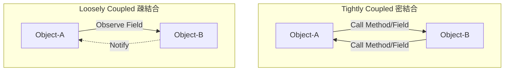
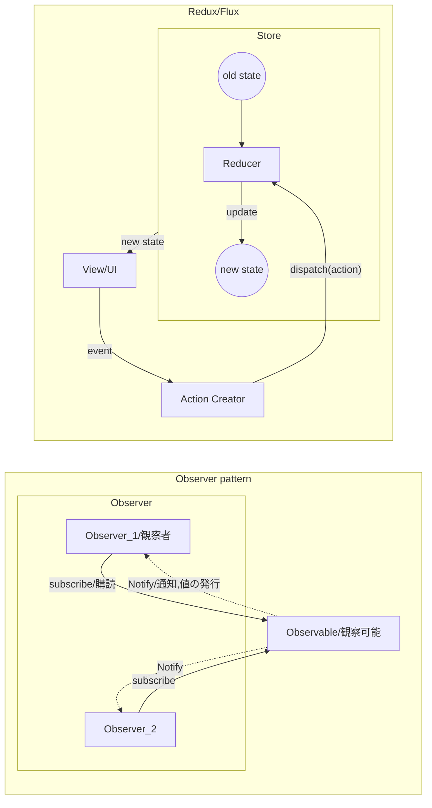

# architecture / design pattern

## Loosely Coupled



Object-AとObject-Bが互いに知っている（参照を持っている）  
↓
Object-AはObject-Bを知っているが、Object-BはObject-Aを知らない  

というように分離しやすい構造

-> Dependency Injection (依存性の注入)  
Class-Bをmockなどに差し替えする = 開発の分離/テストの実現容易性

## GUI Architecture

```
 MVC (Original)

 ┌────┐          Update             ┌─────┐
 │View│◄────────────────────────────┤     │
 └────┘                             │Model│
   Event   ┌──────────┐ Manipulates │     │
  ────────►│Controller├────────────►│     │
           └──────────┘             └─────┘
                                    pt. logic
                                    biz logic
   ViewとModelが密結合
   presentation logicはV or M, Viewが肥大化

 MVP (PassiveView + Observer)

 ┌────┐ Event    ┌─────────┐ Update ┌─────┐
 │    ├─────────►│         ├───────►│     │
 │View│ Update   │Presenter│ Notify │Model│
 │    │◄─────────┤         │◄─ - - -│     │
 └────┘          └─────────┘        └─────┘
                  pt. logic          biz logic

    Presenter -> View の参照がある

 MVVM

 ┌────┐ DataBind ┌─────────┐ Update ┌─────┐
 │    │◄────────►│         ├───────►│     │
 │View│ (Notify) │ViewModel│ Notify │     │
 │    │◄─ - - - -│         │◄─ - - -│     │
 └────┘          └─────────┘        │     │
                                    │Model│
 ┌────┐ DataBind ┌─────────┐ Update │     │
 │    │◄────────►│         ├───────►│     │
 │View│ (Notify) │ViewModel│ Notify │     │
 │    │◄─ - - - -│         │◄─ - - -│     │
 └────┘          └─────────┘        └─────┘
                  pt. logic          biz logic
                                     Data
　  依存の方向 V -> VM, VM -> M
    DataBinding前提
    揮発性
```



- Redux/Flux
  - 関数型で冪等(べきとう)性の確保 (何回実行しても実行結果が同じ状態)
  - stateはReadOnlyなimmutable
  - viewはReactなどvirtual DOM。イメージ的には「まるまるviewの差し替え」
- 
  - Angular : No CDN
  - Vue.js : CDNあるけど怪しい
  - React : CDN動く。デカい。
  - Riot : CDN動く。軽量。双方向データバインディングはX

## WebView

- web technology (front-end)
  - HTML/CSS, Javascript, Node.js, React, wasm
  - browser, Chromium
  - 『プラットフォームを選ばない』
- web technology (back-end)
  - Java, Ruby, JavaScript, SQL
  - Server, API
- native application (managed code)
  - C#(.Net), Swift, Kotlin, Java
  - garbage collection(ARC), Common Intermediate Language(JIT compiler)
- native application (unmanaged/native code)
  - C++, Rust

native applicationに対するweb資産の活用・流用

- Windows GUI 
  - GTK, Qt, WinForms, WPF, UWP, MAUI
  - Qt:M-VC, WPF:MVVM
- Electron
  - 2013 -
  - native app向けGUI Framework, cross-platform
  - GUIにChromium+Node.js = web技術の転用
  - Slack, Discord, GitHub Desktop, Atom, VScode
- WebView
  - Android/iOSのcomponent(OSの機能)
  - スマートフォンapp, Social-network gameなど
  - browser in app
- Tauri
  - rust製, Electronの代替を目指す
  - ChromiumではなくWebViewを使用


### PrismでのRegion

```xml
<grid>
  <Label/>
  <ContentControl prism:RegionManager.RegionName="ContentRegion"/>
</grid>
```

```cs
public partial class App {
  protected override Window CreateShell() {
    return Container.Resolve<MainWindow>();
  }
  protected override void RegisterTypes(IContainerRegistry containerRegistry) {
    containerRegistry.RegisterForNavigation<Views.ViewA>();
  }
}
public class MainWindowViewModel : BindableBase {
  public MainWindowViewModel(IRegionManager regionManager) {
    _regionManager = regionManager;
    _regionManager.RegisterViewWithRegion("ContentRegion", typeof(Views.ViewA));
  }
}
```
MainWindow.xaml -> MainViewModel.cs -> Model.cs  
ViewAWindow.xaml -> ViewAViewModel.cs -> Model.cs  


### WVVM

```
  ┌─────────────────────────┐           ┌─────────┐        ┌─────┐
  │ View                    │ DataBind  │         │ Update │     │
  │ Wpf                     │◄─────────►│         ├───────►│     │
  │             ┌─────────┐ │ (Notify)  │ViewModel│ Notify │     │
  │             │         │ │◄─ - - - - │         │◄─ - - -│     │
  │             │behavior │ │           │         │        │     │
  │             │         │ │           │         │        │     │
  │             └────┬────┘ │           └─────────┘        │Model│
  │                  │      │                              │     │
  └───────────────── │ ─────┘                              │     │
                     ▼ Notify(post or ExecuteScriptAsync)  │     │
  ┌────┐ Event  ┌─────────────────────────────────┐        │     │
  │View├───────►│                                 │ Update │     │
  │Html│ Update │           Presenter             ├───────►│     │
  │    │◄───────┤                                 │        │     │
  └────┘        └─────────────────────────────────┘        └─────┘
                                      biz/pt. logic         biz logic
                                      data                  data
```

- PがModelを間接的に監視してる
- javascript側のLogicをviewを通さないとアクセスできない = viewがmodelを参照してる
