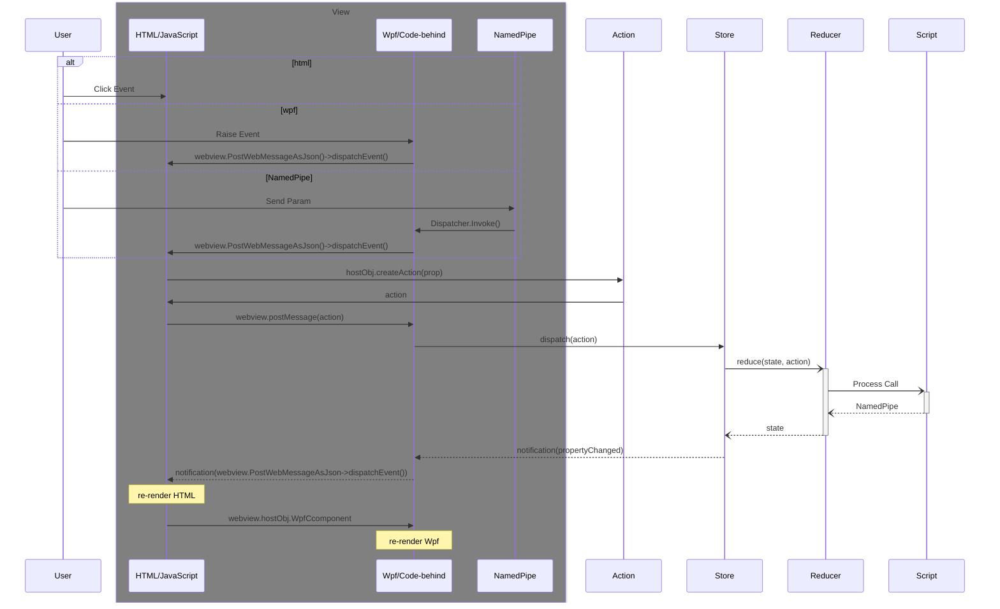
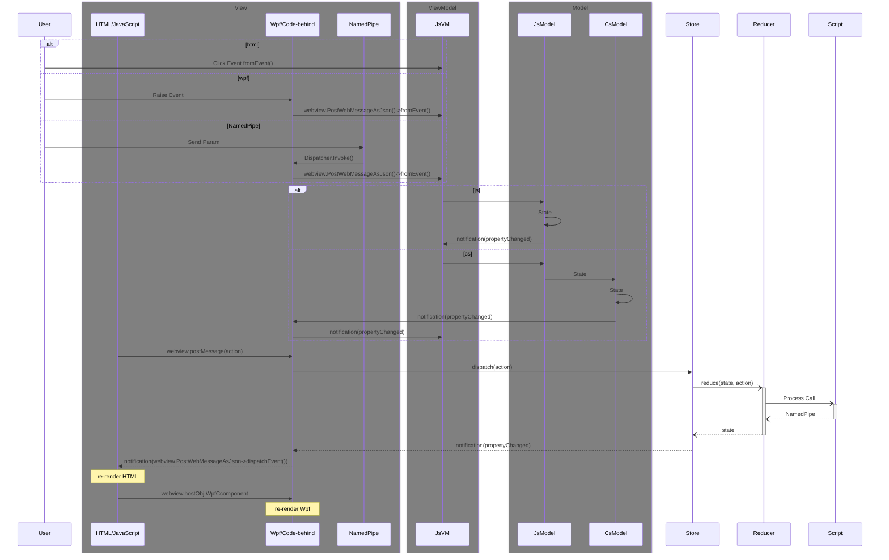

# htipc

## Usage

Reduceなのにimmutableになってないのはご愛敬







### GUI/CLI Command

| function      | GUI                     | command |
| :--           | :--                     | :--     |
| draw          | -                       | draw    |
| zoom-up       | Ctrl + mousewheel-up    | -       |
| zoom-down     | Ctrl + mousewheel-down  | -       |
| bitshift-up   | Shift + mousewheel-up   | shiftup    |
| bitshift-down | Shift + mousewheel-down | shiftdown  |
| bitshift      | -                       | shift [num] |
| rendering     | -                       | rendering [auto | pixelated] |
| get pixel val | mousemove               | - |

### method

| DLL           | CommandLine       | python              | R         | note |
| :--           | :--               | :--                 | :--       | :--  |
|               | htipc search [op] | -                   | -         | |
|               | htipc pipe [op]   | namedpipe           | namedpipe | |
|               |                   | env                 | env       | |
|               |                   | header              | header    | |
|               |                   | get_pixel           | | |
|               |                   | set_pixel           | | |
|               |                   | get_pixels          | | |
|               |                   | set_pixels          | | |
|               |                   | get_fullpixel       | | |
|               |                   | get_fullpixel_array | | use numpy |
|               |                   | set_fullpixel_array | | use numpy |


## 

|                | function               | action type       | action payload       | note |
|:--             | :--                    | :--               | :--                 | :-- |
| cli            | Console Out            | message           | -                   | |
| webview        | js code eval           | eval              | [command]           | |
|                | navigate               | navigate          | [url/path]          | |
|                | send str to js         | poststr           | [string]            | ```js webview.addEventListener('message',()->{}) ``` |
|                | send json to js        | postjson          | [string]            | ```js webview.addEventListener('message',()->{}) ``` |
|                | drop file / click link | navrequest        | [url/path]          | to postjson |
| wpf/native GUI | set title              | title             | [str]               | |
|                | show msgbox            |                   | [str]               | |
|                | resize window          | resizewin         | [left, top, w, h]   | |
| logic          | run subprocess         | process           | [exe, arg]          | |
|                | set mmf                | mmf               | [name, w, h]        | |

```
htipc pipe SquidPipe poststr '{ "a":1, "b":2  }' -a true
```

## htipc option

```ps1
ps> htipc pipe ADDR A B C
# addr : "\\\\.\\pipe\\ADDR
# send : "A B C"

ps> htipc pipe ADDR A B C --json true
# addr : "\\\\.\\pipe\\ADDR"
# send : "[\"A\",\"B\",\"C\"]"

ps> htipc pipe A B C --action true
# addr : "\\\\.\\pipe\\ADDR"
# send : "{\"payload\":[\"B\",\"C\"],\"type\":\"A\"}"
```


## 関係ないけど文字列補間生文字リテラル比較

c#とrustの{}の扱いが逆でハマる

```rust
// rust
let arg = 1;
let hoge = format!(r##" {{ "hoge" : {n} }}  "##);
```

```cs
// c#
var arg = 1;
var hoge = $$""" { "hoge" : "{{arg}}" } """;
```

```javascript
// javascript
let arg = 1;
let hoge = `{ "hoge" : ${arg}  }`;
```

```python
# python3.6
arg = 1
hoge = f'{{ "hoge" : {arg} }}'
```

```R
# R
arg <- 1
hoge <- stringr::str_glue('{{ "hoge" : {arg} }}')
```

## DI Microsoft.Extensions.DependencyInjection

- scope
  - Singleton ```AddSingleton<T,U>()```
  - Scoped ```AddScoped<T,U>()``` : 特定のスコープ毎に新しいインスタンスを生成
  - Transient ```AddTransient<T,U>()``` : 依存の解決を要求するたびに新しいインスタンスを生成

- Injection
  - constructor injection : 
  - method injection : 非対応
  - properties/fields injection : 非対応

サービスロケーターパターンと呼ばれるアンチパターン